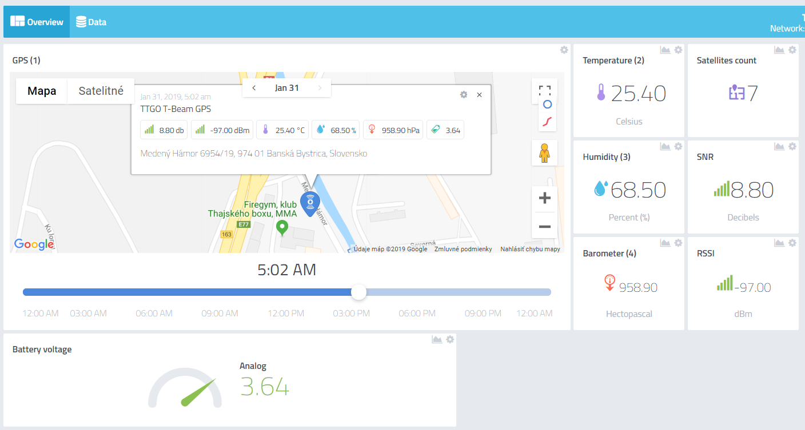
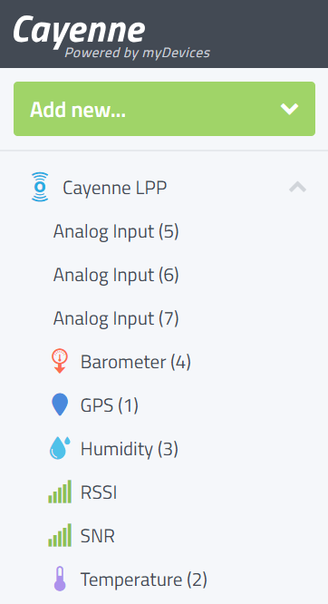
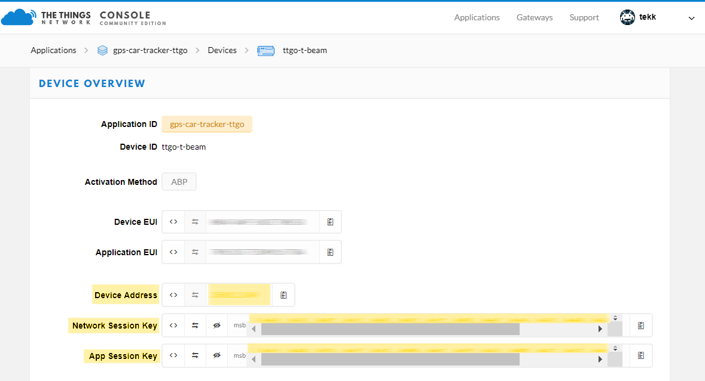
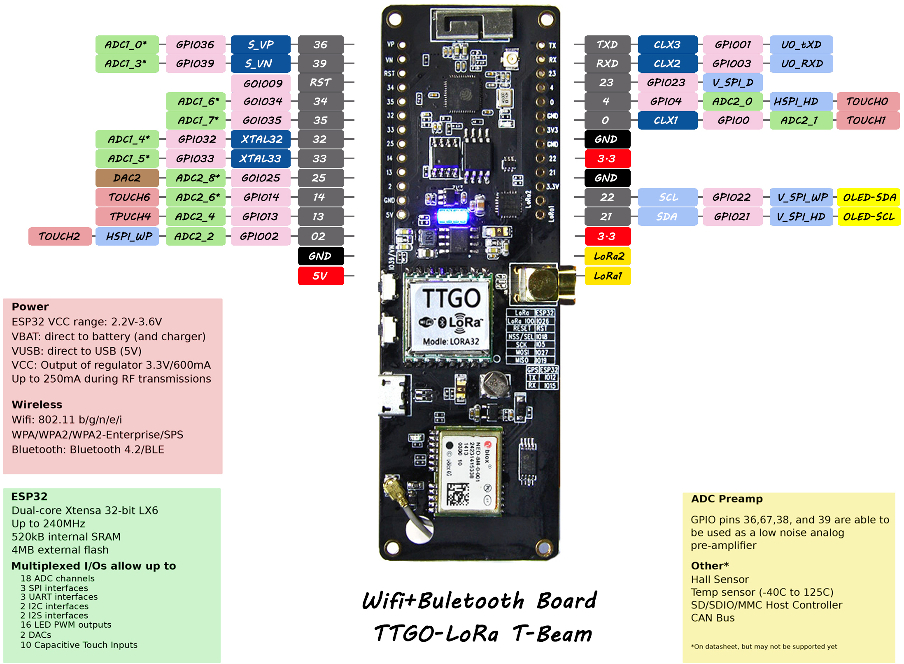
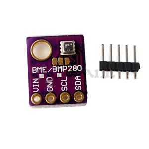
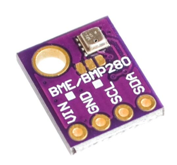
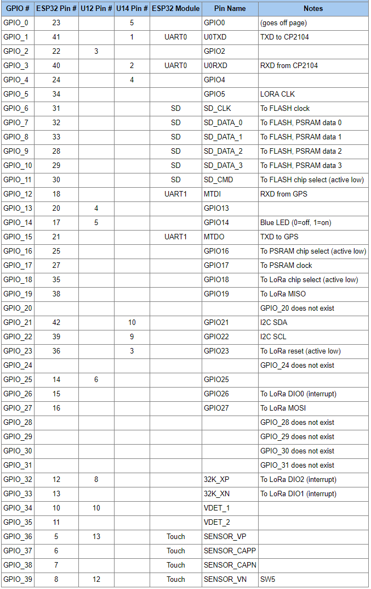
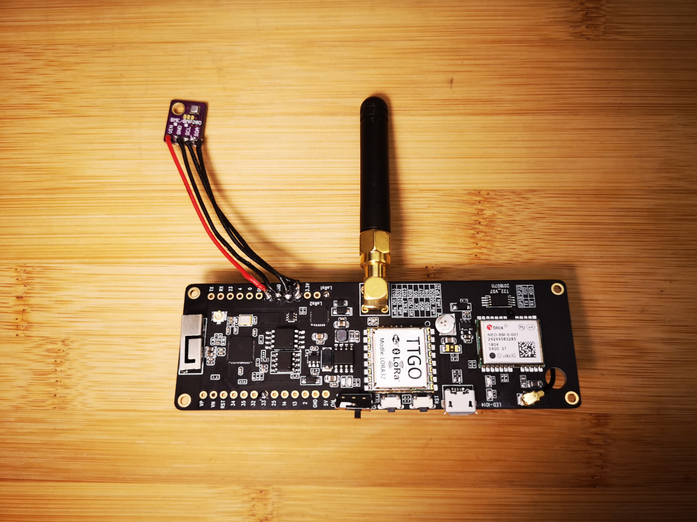
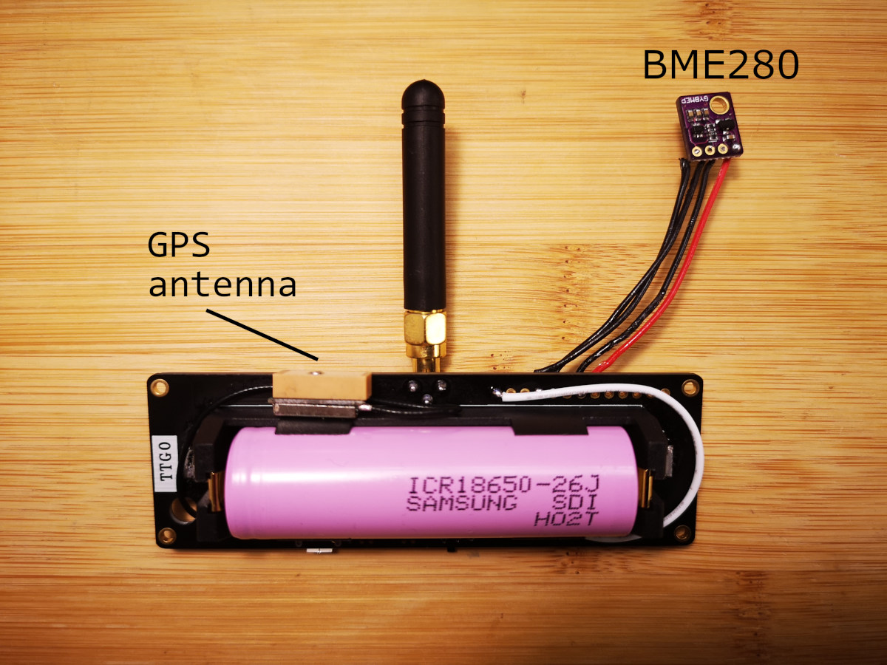

# 🚘 Car GPS tracker with TTGO-T-Beam
 
### ESP32 + GPS + LoRa + GSM <sup>(optional)</sup>

This is an Arduino project for the **[TTGO T-Beam](https://github.com/LilyGO/TTGO-T-Beam)** ESP32 development board, which has LoRa chip onboard.
**Cayenne** backend provides very nice web visualization, and also provides free Android/iPhone apps, where you can watch your car's position and indoor climate.
This project uses [Cayenne Low Power Payload](https://community.mydevices.com/t/cayenne-lpp-2-0/7510) packet format to transfer GPS coordinates and some car's indoor climate data.
It has adaptive packet rate, meaning that when the car moves, tracker starts to 'burst' sending packets to update the trajectory as precise as possible.
The **myDevices [Cayenne for LoRa](https://mydevices.com/cayenne/lora/)** connection is made through [The Things Network](https://www.thethingsnetwork.org/) LoRaWAN cloud.

You can find docs about Cayenne Low Power Payload (LPP) [here](https://mydevices.com/cayenne/docs/lora/#lora-cayenne-low-power-payload).

I'll try to describe whole project setup as best I can.

## 1. Backend setup

1. If you don't already have it, [set up The Things Network account](https://account.thethingsnetwork.org/register)
2. Create new Application in TTN [Applications Console](https://console.thethingsnetwork.org/applications)
3. Add a new device for your new TTN application and select **ABP Activation Method**
4. Insert **Network Session Key**, **App Session Key** and **Device Address** to file `config.h` in Arduino project
5. Upload sketch to your board, you can program the T-Beam using the [Arduino ESP32](https://github.com/espressif/arduino-esp32) board `Heltec_WIFI_LoRa_32`
6. In your TTN application, in section **Payload formats** select `Cayenne LPP`
7. In **Integrations** section, select `Cayenne`
8. Fill **Process ID** (choose any name you prefer), select **Default Access Key** and click on **Add integration**
9. [Log in to myDevices Cayenne](https://cayenne.mydevices.com/), on the top click on `+` and enter project name
10. Click on **Add new** -> **Device/Widget** -> **LoRa** -> **The Things Network** -> **Cayenne LPP**
11. Choose your **Name** and fill out **DevEUI** (copy **Device EUI** from [TTN Console](https://console.thethingsnetwork.org/)). Then select **Activation Mode** -> **Already Registered**, **Tracking** -> **This device moves**. Click **Add device**.
12. If your tracker already sent any data to TTN, you'll see bunch of data fields. You can drag them to your Cayenne project.
13. Install the **Cayenne** mobile app to your Android/iPhone.

#### That's it 😃

### Cayenne Screenshot

This is how it will look like when data is received by TTN and Cayenne.



### Cayenne data fields

- After these steps, you will see these data fields in Cayenne Dashboard:



> Note: In GPS field, there is also **GPS altitude** information available.

Optional fields, you can choose to send them in the program:

- **Analog Input (5)**: Battery voltage (in volts)
- **Analog Input (6)**: If tracker is moving, this field is **GPS speed**, in km/h
- **Analog Input (7)**: Number of **satellites**, that the GPS module currently 'sees'
- **Analog Input (8)**: Approximate tracker's **altitude** calculated from barometric air pressure

## 2. Wiring

⚠️ You need to connect the [T-Beam](https://github.com/LilyGO/TTGO-T-Beam) `LoRa DIO1` pin marked as `Lora1` to the **pin 33** - So that the ESP32 can read that output from the Lora module.
Optionally you can also connect the `Lora2` output to `GPIO 32`, but this is not needed here.

Connect the BME/BMP280 module's `SDA` line to pin `21` and `SCL` to pin `22` on the TTGO.
If you want a more reliable data line (if the wires are long for some reason), you can add **pull-up resistors** on SDA and SCL lines.
Any value from 2.2k to 10k should be OK.
`VCC` of the module to `3V3` and `GND` to `GND` of course.

## 3. Libraries needed

- [ESP32 Core for Arduino](https://github.com/espressif/arduino-esp32/blob/master/docs/arduino-ide/boards_manager.md) (installation with Boards Manager)
- [TinyGPS++](https://github.com/mikalhart/TinyGPSPlus)
- [CayenneLPP](https://github.com/sabas1080/CayenneLPP)
- [BME280-I2C-ESP32](https://github.com/Takatsuki0204/BME280-I2C-ESP32)
	- Delete / uninstall original Adafruit BME280 library after installing this, otherwise it will cause conflicts!
- [Arduino-LMIC](https://github.com/matthijskooijman/arduino-lmic)


### Update `config.h`

If you haven't already, update with your own [TTN keys](https://www.thethingsnetwork.org/docs/devices/registration.html) - **ABP authentication**

##### TTN Keys

These are the keys you will need from the TTN console (marked yellow).



# Hardware

- **TTGO-T-Beam**
	- ESP32 + GPS + LoRa



- **A6 GSM/GPRS module** <sup>(work in progress, not yet implemented!)</sup>
	- For places without LoRaWAN coverage - sends a link to Google Maps position via an SMS


- **BME/BMP280 module**
	- For temperature, humidity, and atmospheric pressure reporting
	- Fully implemented and working with the sketch




## Reference

### TTGO-T-Beam Specifications
```
ESP32
  ESP32 Version REV1
  WiFi
  Bluetooth 
  4MB Flash
  3D Antenna
 
LORA
  Working voltage:      1.8 ~ 3.7v
  Acceptable current:   10 ~ 14mA
  Transmit current:     120mA @ +20dBm
                         90mA @ +17dBm
                         29mA @ +13dBm
  Operating frequency:  433MHz / 868MHz / 915MHz
  Transmit power:       +20dBm
  Receive sensitivity:  -139dBm @ LoRa &  62.5 KHz & SF=12 &  146bps
                        -136dBm @ LoRa & 125 KHz   & SF=12 &  293bps
                        -118dBm @ LoRa & 125 KHz   & SF=6  & 9380bps
                        -123dBm @ FSK  &   5 KHz   & 1.2Kbps
  Frequency error:       +/-15KHz
  FIFO space:            64 byte
  Data rate:             1.2K ~ 300Kbps @ FSK
                         0.018K ~ 37.5Kbps @ LoRa        
  Modulation Mode:       FSK, GFSK, MSK, GMSK, LoRa TM, OOK
  Interface form:        SPI
  Sleep current:         0.2uA @ SLEEP
                         1.5uA @ IDLE
  Operating temperature: -40? - +85?
  Digital RSSI function
  Automatic frequency correction
  Automatic gain control 
  RF wake-up function
  Low voltage detection and temperature sensor
  Fast wake-up and frequency hopping
  Highly configurable data packet handler

GPS
  GPS modules NEO-6M, 3V-5V power supply Universal
  Destined module with ceramic antenna, signal super
  Save the configuration parameter data EEPROM Down
  With data backup battery
  There are LED signal indicator
  Default Baud Rate: 9600

Power
  IP5306 2A Battery PMIC
  LED, Blue - User controller
  LED, Red - GPS 1PPS
  LED, Red/green - battery charged/power on
  Button, reset switch
  Button, user readable
  Switch, power on/battery charge
  USB
  CP2104-GMR
```

### TTGO T-Beam Pin Map



### First prototype




## TODO

- A6 GSM module is not yet implemented
	- I'll be adding this "backup" comms feature someday
- Add serial terminal console via WiFi AP
	- To watch output & debug messages (Websockets?)

## Further improvement

You are welcome to contribute to this project in any way. (Submit an issue, bug report, fork and improve...)
Suggestions & feedback is much appreciated.

## Credits

- Thanks to [DeuxVis](https://github.com/DeuxVis) for his [Lora-TTNMapper-T-Beam](https://github.com/DeuxVis/Lora-TTNMapper-T-Beam) which came as an inspiration for this project
- Huge thanks goes to my beloved wife for helping me to buy us a new car 😃 I love you Evka.❤️